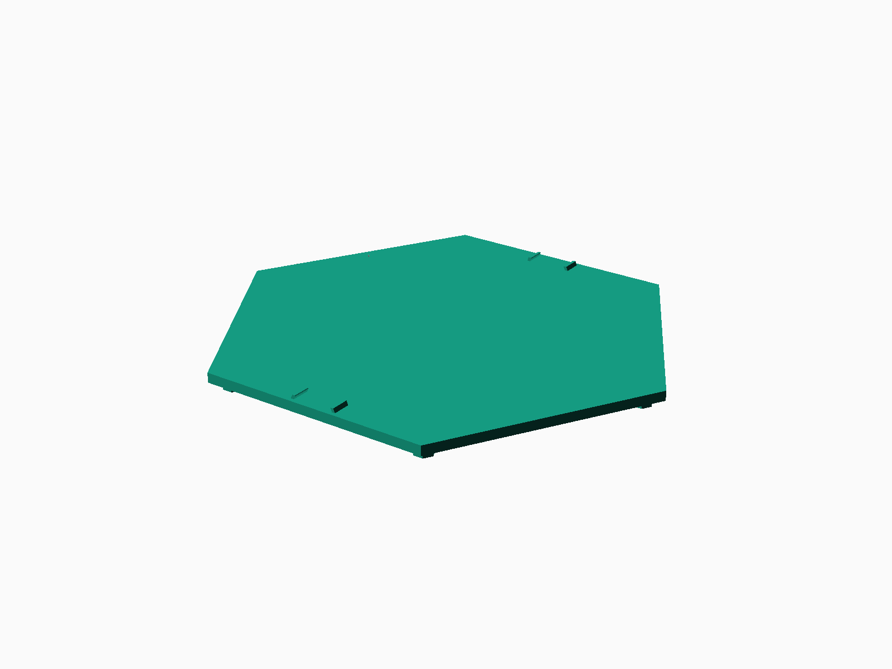
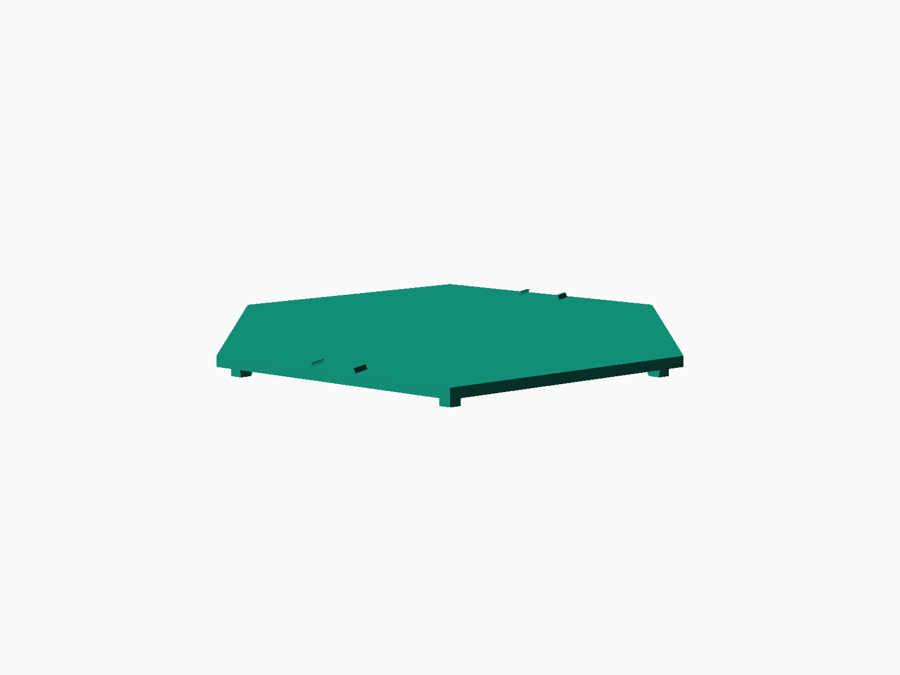

# HexTrack Modular N-Scale Layout

Printable OpenSCAD files and STL exports for a modular N-scale train layout using the Hex-Trak standard.

The main module is a 248 mm flat-to-flat hex tile designed around Kato N-scale Unitrack geometry. The full tile is larger than a 255 mm printer bed point-to-point, so the source supports split half-tile printing.

## Render Previews

Full tile using the `SeamTrackClip` OpenSCAD preset:

## Source Files

The OpenSCAD source and OpenSCAD Customizer presets are in `source/`:

- `HexTrackSingleTile.scad`
- `HexTrackSingleTile.json`
- `HexTrackDoubleTile.scad`
- `HexTrackGluingJig.scad`
- `HexTrackGluingJig.json`
- `DCCEXElectronicsMountain.scad`
- `DCCEXElectronicsMountain_v2.scad`
- `double layer.scad`
- `double layer.json`

## Printable Files

The current STL exports are in `stl/`.

Top-level jig and clip files:

- `stl/HexTrackSeamTrackClipFullTile.stl`
- `stl/HexTrackGluingJig.stl`
- `stl/HexTrackGluingJigCenter.stl`
- `stl/Track Clip.stl`

Half-tile exports are organized under:

- `stl/HalfTile/`
- `stl/HalfTile/NoClips/`
- `stl/HalfTile/TileWithClips/`
- `stl/HalfTile/TileWithClips/Curve/`

## Main Dimensions

- Hex standard: Hex-Trak
- Flat-to-flat width: 248 mm
- Point-to-point width: about 286 mm
- Tile height off table: 12 mm
- Plate thickness: 4 mm
- Feet height: 8 mm
- Track lane spacing: 33 mm center-to-center
- Reference track geometry: Kato 248 mm straight track and 216 mm radius curves

## Printing Split Tiles

For printers with a 255 mm bed, use the split settings in `source/HexTrackSingleTile.scad`:

- `split_mode = 0`: full tile for larger beds
- `split_mode = 1`: right half
- `split_mode = 2`: left half

Print both halves and join them using the integrated rabbit clips and sockets. The parameter `joiner_male_half` controls which side receives the clips.

Useful fit-tuning parameters:

- `rabbit_clip_depth`
- `rabbit_clip_clearance`
- `rabbit_clip_compression`
- `rabbit_clip_socket_extra_depth`

## Track Clips

The model can preview imported Kato track clips at selected module sides. In the OpenSCAD Customizer:

- Set `show_track_clips = true`
- Set `track_clip_file` to the clip STL filename
- Toggle side placement with `track_clip_at_side0` through `track_clip_at_side5`
- Use `track_clip_edge_offset`, `track_clip_spacing`, and `track_clip_rotation_z` to tune placement

Clip preview imports are for placement checking only and are not exported as part of the tile geometry.

## Feeder Wire Holes

Feeder holes can be cut directly into the tile from `HexTrackSingleTile.scad`:

- `add_feeder_holes = true`
- `feeder_hole_diameter`
- `feeder_hole_side`
- `feeder_hole_lane`
- `feeder_hole_inset`
- `feeder_hole_count`
- `feeder_hole_spacing`

Use `show_feeder_hole_preview = true` while positioning holes.

## DCC-EX Electronics Mountain

`source/DCCEXElectronicsMountain.scad` is a standalone hollow mountain cover sized for one HexTrack tile. The default model has a 220 mm by 205 mm base, a 160 mm height, an open bottom for electronics access, and two side cable exits:

- 22 mm hole for a 120 V power cable
- 16 mm hole for low-voltage layout wiring

The default footprint is intended to fit within a 232 mm cubed printer volume while leaving a small margin for slicer settings. Print it as a separate cover and dry fit it over the DCC-EX electronics before routing mains wiring.

By default, both cable exits are on the front edge near the bottom; change `cable_side` in OpenSCAD to move them to the back, left, or right.

## Reference

The Hex-Trak reference PDF is included in `reference/`.

Useful external references:

- https://hex-trak.com/what-is-hextrak
- https://www.facebook.com/groups/hextrakhive/
- https://www.yeggi.com/q/kato+unitrack/
- https://www.stlfinder.com/3dmodels/n-scale-kato-unitrack/
- https://www.printables.com/model/1180909-kato-unitrack-rail-clips/files

## Print Notes

- Material: PLA Pro, PETG, or another material appropriate for layout modules
- Walls: 3-4+
- Infill: 15-30%
- Dry fit split halves, clips, and track before producing a full set
- Re-check tolerances if switching printers, nozzle size, or material
